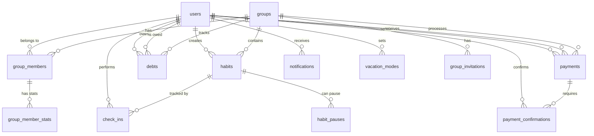

# Database Schema - Staked App

## Implementation Status Tracker

### Quick Status Overview
- 🔴 Not Started
- 🟡 In Progress
- 🟢 Completed
- ⏸️ Blocked/Waiting

## Overview
PostgreSQL database schema using Supabase with Row Level Security (RLS) policies for multi-tenant group-based access control.

## Implementation Checklist

### Phase 1: Database Foundation
- [x] 🟢 Design database schema ERD
- [x] 🟢 Define table relationships
- [x] 🟢 Plan indexing strategy
- [x] 🟢 Define data types and constraints
- [x] 🟢 Document database naming conventions

## Entity Relationship Diagram



## Core Tables

### Phase 2: Core Tables Implementation

#### Users Table Tasks
- [x] 🟢 Create users table migration file
- [x] 🟢 Add id field with UUID primary key
- [x] 🟢 Add email field with unique constraint
- [x] 🟢 Add username field with unique constraint
- [x] 🟢 Add full_name field
- [x] 🟢 Add avatar_url field
- [x] 🟢 Add push_token field
- [x] 🟢 Add notification preference fields
- [x] 🟢 Add timezone field with default UTC
- [x] 🟢 Add timestamp fields (created_at, updated_at, deleted_at)
- [x] 🟢 Add metadata JSONB field
- [x] 🟢 Create indexes on email and username
- [x] 🟢 Create index on deleted_at for soft deletes
- [x] 🟢 Define users table constraints
- [x] 🟢 Document users table relationships

### 1. users
```sql
CREATE TABLE users (
  id UUID PRIMARY KEY DEFAULT gen_random_uuid(),
  email VARCHAR(255) UNIQUE NOT NULL,
  username VARCHAR(50) UNIQUE NOT NULL,
  full_name VARCHAR(255),
  avatar_url TEXT,
  push_token TEXT,
  email_notifications BOOLEAN DEFAULT true,
  push_notifications BOOLEAN DEFAULT true,
  timezone VARCHAR(50) DEFAULT 'UTC',
  created_at TIMESTAMPTZ DEFAULT NOW(),
  updated_at TIMESTAMPTZ DEFAULT NOW(),
  deleted_at TIMESTAMPTZ,
  metadata JSONB DEFAULT '{}'::jsonb
);

CREATE INDEX idx_users_email ON users(email);
CREATE INDEX idx_users_username ON users(username);
CREATE INDEX idx_users_deleted_at ON users(deleted_at);
```

#### Groups Table Tasks
- [x] 🟢 Create groups table migration file
- [x] 🟢 Add id field with UUID primary key
- [x] 🟢 Add name field (required)
- [x] 🟢 Add description field
- [x] 🟢 Add created_by foreign key to users
- [x] 🟢 Add currency_code field with default USD
- [x] 🟢 Add max_members field with default 10
- [x] 🟢 Add is_active boolean with default true
- [x] 🟢 Add is_archived boolean with default false
- [x] 🟢 Add timestamp fields
- [x] 🟢 Add settings JSONB field with defaults
- [x] 🟢 Create indexes for created_by, is_active, is_archived
- [x] 🟢 Define groups table constraints
- [x] 🟢 Document groups table relationships

### 2. groups
```sql
CREATE TABLE groups (
  id UUID PRIMARY KEY DEFAULT gen_random_uuid(),
  name VARCHAR(255) NOT NULL,
  description TEXT,
  created_by UUID REFERENCES users(id) ON DELETE SET NULL,
  currency_code VARCHAR(3) NOT NULL DEFAULT 'USD',
  max_members INTEGER DEFAULT 10,
  is_active BOOLEAN DEFAULT true,
  is_archived BOOLEAN DEFAULT false,
  created_at TIMESTAMPTZ DEFAULT NOW(),
  updated_at TIMESTAMPTZ DEFAULT NOW(),
  settings JSONB DEFAULT '{
    "auto_archive_days": 90,
    "allow_late_checkins": false,
    "notification_settings": {}
  }'::jsonb
);

CREATE INDEX idx_groups_created_by ON groups(created_by);
CREATE INDEX idx_groups_is_active ON groups(is_active);
CREATE INDEX idx_groups_is_archived ON groups(is_archived);
```

#### Remaining Core Tables Tasks
- [x] 🟢 Create group_members table with junction fields
- [x] 🟢 Create group_invitations table with invitation codes
- [x] 🟢 Create habits table with frequency and stake fields
- [x] 🟢 Create check_ins table with status tracking
- [x] 🟢 Create debts table with debtor/creditor relationships
- [x] 🟢 Create payments table with confirmation workflow
- [x] 🟢 Create payment_confirmations junction table
- [x] 🟢 Create vacation_modes table with date ranges
- [x] 🟢 Create notifications table with read status
- [x] 🟢 Create group_member_stats aggregation table
- [x] 🟢 Create habit_pauses table for temporary stops
- [x] 🟢 Add all foreign key constraints
- [x] 🟢 Add all unique constraints
- [x] 🟢 Add all check constraints
- [x] 🟢 Create all necessary indexes
- [x] 🟢 Define all table relationships
- [x] 🟢 Document cascade delete rules

### 3. group_members
```sql
CREATE TABLE group_members (
  id UUID PRIMARY KEY DEFAULT gen_random_uuid(),
  group_id UUID REFERENCES groups(id) ON DELETE CASCADE,
  user_id UUID REFERENCES users(id) ON DELETE CASCADE,
  role VARCHAR(20) NOT NULL DEFAULT 'member',
  joined_at TIMESTAMPTZ DEFAULT NOW(),
  left_at TIMESTAMPTZ,
  is_active BOOLEAN DEFAULT true,
  invited_by UUID REFERENCES users(id) ON DELETE SET NULL,
  CONSTRAINT unique_active_member UNIQUE(group_id, user_id),
  CONSTRAINT valid_role CHECK (role IN ('owner', 'admin', 'member'))
);

CREATE INDEX idx_group_members_group ON group_members(group_id);
CREATE INDEX idx_group_members_user ON group_members(user_id);
CREATE INDEX idx_group_members_active ON group_members(is_active);
```

### 4. group_invitations
```sql
CREATE TABLE group_invitations (
  id UUID PRIMARY KEY DEFAULT gen_random_uuid(),
  group_id UUID REFERENCES groups(id) ON DELETE CASCADE,
  invited_by UUID REFERENCES users(id) ON DELETE CASCADE,
  invited_email VARCHAR(255),
  invited_user_id UUID REFERENCES users(id) ON DELETE CASCADE,
  invitation_code VARCHAR(8) UNIQUE NOT NULL,
  status VARCHAR(20) DEFAULT 'pending',
  created_at TIMESTAMPTZ DEFAULT NOW(),
  expires_at TIMESTAMPTZ DEFAULT NOW() + INTERVAL '7 days',
  accepted_at TIMESTAMPTZ,
  CONSTRAINT valid_status CHECK (status IN ('pending', 'accepted', 'declined', 'expired'))
);

CREATE INDEX idx_invitations_group ON group_invitations(group_id);
CREATE INDEX idx_invitations_code ON group_invitations(invitation_code);
CREATE INDEX idx_invitations_status ON group_invitations(status);
```

### 5. habits
```sql
CREATE TABLE habits (
  id UUID PRIMARY KEY DEFAULT gen_random_uuid(),
  group_id UUID REFERENCES groups(id) ON DELETE CASCADE,
  user_id UUID REFERENCES users(id) ON DELETE CASCADE,
  name VARCHAR(255) NOT NULL,
  description TEXT,
  frequency_type VARCHAR(20) NOT NULL,
  frequency_value INTEGER DEFAULT 1,
  frequency_days INTEGER[] DEFAULT '{}',
  check_in_deadline TIME NOT NULL,
  stake_amount DECIMAL(10, 2) NOT NULL,
  is_active BOOLEAN DEFAULT true,
  is_paused BOOLEAN DEFAULT false,
  created_at TIMESTAMPTZ DEFAULT NOW(),
  updated_at TIMESTAMPTZ DEFAULT NOW(),
  starts_at DATE DEFAULT CURRENT_DATE,
  ends_at DATE,
  metadata JSONB DEFAULT '{}'::jsonb,
  CONSTRAINT valid_frequency CHECK (frequency_type IN ('daily', 'weekly', 'monthly', 'custom')),
  CONSTRAINT positive_stake CHECK (stake_amount > 0)
);

CREATE INDEX idx_habits_group ON habits(group_id);
CREATE INDEX idx_habits_user ON habits(user_id);
CREATE INDEX idx_habits_active ON habits(is_active);
CREATE INDEX idx_habits_paused ON habits(is_paused);
```

### 6. check_ins
```sql
CREATE TABLE check_ins (
  id UUID PRIMARY KEY DEFAULT gen_random_uuid(),
  habit_id UUID REFERENCES habits(id) ON DELETE CASCADE,
  user_id UUID REFERENCES users(id) ON DELETE CASCADE,
  check_in_date DATE NOT NULL,
  status VARCHAR(20) NOT NULL,
  checked_at TIMESTAMPTZ,
  deadline TIMESTAMPTZ NOT NULL,
  notes TEXT,
  created_at TIMESTAMPTZ DEFAULT NOW(),
  updated_at TIMESTAMPTZ DEFAULT NOW(),
  CONSTRAINT valid_status CHECK (status IN ('pending', 'completed', 'missed', 'excused')),
  CONSTRAINT unique_daily_checkin UNIQUE(habit_id, check_in_date)
);

CREATE INDEX idx_checkins_habit ON check_ins(habit_id);
CREATE INDEX idx_checkins_user ON check_ins(user_id);
CREATE INDEX idx_checkins_date ON check_ins(check_in_date);
CREATE INDEX idx_checkins_status ON check_ins(status);
```

### 7. debts
```sql
CREATE TABLE debts (
  id UUID PRIMARY KEY DEFAULT gen_random_uuid(),
  group_id UUID REFERENCES groups(id) ON DELETE CASCADE,
  debtor_id UUID REFERENCES users(id) ON DELETE CASCADE,
  creditor_id UUID REFERENCES users(id) ON DELETE CASCADE,
  amount DECIMAL(10, 2) NOT NULL,
  currency_code VARCHAR(3) NOT NULL,
  reason VARCHAR(255),
  habit_id UUID REFERENCES habits(id) ON DELETE SET NULL,
  check_in_id UUID REFERENCES check_ins(id) ON DELETE SET NULL,
  is_settled BOOLEAN DEFAULT false,
  is_archived BOOLEAN DEFAULT false,
  created_at TIMESTAMPTZ DEFAULT NOW(),
  settled_at TIMESTAMPTZ,
  notes TEXT,
  CONSTRAINT positive_amount CHECK (amount > 0),
  CONSTRAINT different_parties CHECK (debtor_id != creditor_id)
);

CREATE INDEX idx_debts_group ON debts(group_id);
CREATE INDEX idx_debts_debtor ON debts(debtor_id);
CREATE INDEX idx_debts_creditor ON debts(creditor_id);
CREATE INDEX idx_debts_settled ON debts(is_settled);
CREATE INDEX idx_debts_archived ON debts(is_archived);
```

### 8. payments
```sql
CREATE TABLE payments (
  id UUID PRIMARY KEY DEFAULT gen_random_uuid(),
  group_id UUID REFERENCES groups(id) ON DELETE CASCADE,
  payer_id UUID REFERENCES users(id) ON DELETE CASCADE,
  receiver_id UUID REFERENCES users(id) ON DELETE CASCADE,
  amount DECIMAL(10, 2) NOT NULL,
  currency_code VARCHAR(3) NOT NULL,
  payment_method VARCHAR(50),
  transaction_reference VARCHAR(255),
  status VARCHAR(20) DEFAULT 'pending',
  created_at TIMESTAMPTZ DEFAULT NOW(),
  confirmed_at TIMESTAMPTZ,
  notes TEXT,
  CONSTRAINT valid_status CHECK (status IN ('pending', 'confirmed', 'disputed', 'cancelled')),
  CONSTRAINT positive_amount CHECK (amount > 0)
);

CREATE INDEX idx_payments_group ON payments(group_id);
CREATE INDEX idx_payments_payer ON payments(payer_id);
CREATE INDEX idx_payments_receiver ON payments(receiver_id);
CREATE INDEX idx_payments_status ON payments(status);
```

### 9. payment_confirmations
```sql
CREATE TABLE payment_confirmations (
  id UUID PRIMARY KEY DEFAULT gen_random_uuid(),
  payment_id UUID REFERENCES payments(id) ON DELETE CASCADE,
  confirmed_by UUID REFERENCES users(id) ON DELETE CASCADE,
  confirmed_at TIMESTAMPTZ DEFAULT NOW(),
  disputed_at TIMESTAMPTZ,
  dispute_reason TEXT,
  CONSTRAINT unique_confirmation UNIQUE(payment_id, confirmed_by)
);

CREATE INDEX idx_confirmations_payment ON payment_confirmations(payment_id);
CREATE INDEX idx_confirmations_user ON payment_confirmations(confirmed_by);
```

### 10. vacation_modes
```sql
CREATE TABLE vacation_modes (
  id UUID PRIMARY KEY DEFAULT gen_random_uuid(),
  user_id UUID REFERENCES users(id) ON DELETE CASCADE,
  group_id UUID REFERENCES groups(id) ON DELETE CASCADE,
  habit_id UUID REFERENCES habits(id) ON DELETE CASCADE,
  starts_at TIMESTAMPTZ NOT NULL,
  ends_at TIMESTAMPTZ NOT NULL,
  reason TEXT,
  is_active BOOLEAN DEFAULT true,
  created_at TIMESTAMPTZ DEFAULT NOW(),
  cancelled_at TIMESTAMPTZ,
  CONSTRAINT valid_dates CHECK (ends_at > starts_at)
);

CREATE INDEX idx_vacation_user ON vacation_modes(user_id);
CREATE INDEX idx_vacation_group ON vacation_modes(group_id);
CREATE INDEX idx_vacation_habit ON vacation_modes(habit_id);
CREATE INDEX idx_vacation_active ON vacation_modes(is_active);
```

### 11. notifications
```sql
CREATE TABLE notifications (
  id UUID PRIMARY KEY DEFAULT gen_random_uuid(),
  user_id UUID REFERENCES users(id) ON DELETE CASCADE,
  type VARCHAR(50) NOT NULL,
  title VARCHAR(255) NOT NULL,
  body TEXT NOT NULL,
  data JSONB DEFAULT '{}'::jsonb,
  is_read BOOLEAN DEFAULT false,
  read_at TIMESTAMPTZ,
  created_at TIMESTAMPTZ DEFAULT NOW(),
  expires_at TIMESTAMPTZ DEFAULT NOW() + INTERVAL '30 days'
);

CREATE INDEX idx_notifications_user ON notifications(user_id);
CREATE INDEX idx_notifications_read ON notifications(is_read);
CREATE INDEX idx_notifications_type ON notifications(type);
CREATE INDEX idx_notifications_created ON notifications(created_at DESC);
```

### 12. group_member_stats
```sql
CREATE TABLE group_member_stats (
  id UUID PRIMARY KEY DEFAULT gen_random_uuid(),
  group_id UUID REFERENCES groups(id) ON DELETE CASCADE,
  user_id UUID REFERENCES users(id) ON DELETE CASCADE,
  total_habits INTEGER DEFAULT 0,
  total_checkins INTEGER DEFAULT 0,
  successful_checkins INTEGER DEFAULT 0,
  missed_checkins INTEGER DEFAULT 0,
  total_stake_amount DECIMAL(10, 2) DEFAULT 0,
  total_debt_owed DECIMAL(10, 2) DEFAULT 0,
  total_debt_owed_to DECIMAL(10, 2) DEFAULT 0,
  streak_current INTEGER DEFAULT 0,
  streak_longest INTEGER DEFAULT 0,
  last_checkin_at TIMESTAMPTZ,
  updated_at TIMESTAMPTZ DEFAULT NOW(),
  CONSTRAINT unique_member_stats UNIQUE(group_id, user_id)
);

CREATE INDEX idx_stats_group ON group_member_stats(group_id);
CREATE INDEX idx_stats_user ON group_member_stats(user_id);
```

### 13. habit_pauses
```sql
CREATE TABLE habit_pauses (
  id UUID PRIMARY KEY DEFAULT gen_random_uuid(),
  habit_id UUID REFERENCES habits(id) ON DELETE CASCADE,
  user_id UUID REFERENCES users(id) ON DELETE CASCADE,
  paused_at TIMESTAMPTZ DEFAULT NOW(),
  resumed_at TIMESTAMPTZ,
  reason TEXT,
  is_active BOOLEAN DEFAULT true
);

CREATE INDEX idx_pauses_habit ON habit_pauses(habit_id);
CREATE INDEX idx_pauses_user ON habit_pauses(user_id);
CREATE INDEX idx_pauses_active ON habit_pauses(is_active);
```

## Database Functions & Triggers

### Phase 3: Functions Implementation

#### Database Functions Tasks
- [ ] 🔴 Create create_daily_checkins() function
- [ ] 🔴 Document check-in generation algorithm
- [ ] 🔴 Create calculate_missed_checkin_debts() function
- [ ] 🔴 Document debt calculation formula
- [ ] 🔴 Create update_member_stats() function
- [ ] 🔴 Document statistics aggregation logic
- [ ] 🔴 Create get_net_debts() function
- [ ] 🔴 Document net debt calculation method
- [ ] 🔴 Create streak calculation function
- [ ] 🔴 Create leaderboard generation function
- [ ] 🔴 Add function execution permissions
- [ ] 🔴 Create function documentation

#### Database Triggers Tasks
- [ ] 🔴 Create trigger for missed check-in debt creation
- [ ] 🔴 Create trigger for stats updates on check-ins
- [ ] 🔴 Create trigger for notification creation
- [ ] 🔴 Create trigger for updated_at timestamp
- [ ] 🔴 Document trigger execution order
- [ ] 🔴 Define trigger performance requirements
- [ ] 🔴 Add trigger error handling

### 1. Auto-create check-ins for active habits
```sql
CREATE OR REPLACE FUNCTION create_daily_checkins()
RETURNS void AS $$
BEGIN
  INSERT INTO check_ins (habit_id, user_id, check_in_date, status, deadline)
  SELECT 
    h.id,
    h.user_id,
    CURRENT_DATE,
    'pending',
    CURRENT_DATE + h.check_in_deadline
  FROM habits h
  WHERE h.is_active = true 
    AND h.is_paused = false
    AND NOT EXISTS (
      SELECT 1 FROM check_ins c 
      WHERE c.habit_id = h.id 
        AND c.check_in_date = CURRENT_DATE
    );
END;
$$ LANGUAGE plpgsql;
```

### 2. Calculate and create debts for missed check-ins
```sql
CREATE OR REPLACE FUNCTION calculate_missed_checkin_debts()
RETURNS trigger AS $$
DECLARE
  group_member RECORD;
  member_count INTEGER;
  debt_per_member DECIMAL(10, 2);
BEGIN
  IF NEW.status = 'missed' AND OLD.status = 'pending' THEN
    SELECT group_id, stake_amount INTO STRICT group_member
    FROM habits WHERE id = NEW.habit_id;
    
    SELECT COUNT(*) INTO member_count
    FROM group_members 
    WHERE group_id = group_member.group_id 
      AND is_active = true 
      AND user_id != NEW.user_id;
    
    IF member_count > 0 THEN
      debt_per_member := group_member.stake_amount / member_count;
      
      INSERT INTO debts (group_id, debtor_id, creditor_id, amount, currency_code, reason, habit_id, check_in_id)
      SELECT 
        group_member.group_id,
        NEW.user_id,
        gm.user_id,
        debt_per_member,
        g.currency_code,
        'Missed check-in',
        NEW.habit_id,
        NEW.id
      FROM group_members gm
      JOIN groups g ON g.id = gm.group_id
      WHERE gm.group_id = group_member.group_id 
        AND gm.is_active = true 
        AND gm.user_id != NEW.user_id;
    END IF;
  END IF;
  
  RETURN NEW;
END;
$$ LANGUAGE plpgsql;

CREATE TRIGGER trigger_calculate_debts
AFTER UPDATE ON check_ins
FOR EACH ROW
EXECUTE FUNCTION calculate_missed_checkin_debts();
```

### 3. Update group member statistics
```sql
CREATE OR REPLACE FUNCTION update_member_stats()
RETURNS trigger AS $$
BEGIN
  INSERT INTO group_member_stats (group_id, user_id, successful_checkins, missed_checkins, last_checkin_at)
  SELECT 
    h.group_id,
    NEW.user_id,
    CASE WHEN NEW.status = 'completed' THEN 1 ELSE 0 END,
    CASE WHEN NEW.status = 'missed' THEN 1 ELSE 0 END,
    CASE WHEN NEW.status = 'completed' THEN NEW.checked_at ELSE NULL END
  FROM habits h
  WHERE h.id = NEW.habit_id
  ON CONFLICT (group_id, user_id) DO UPDATE
  SET 
    successful_checkins = group_member_stats.successful_checkins + 
      CASE WHEN NEW.status = 'completed' THEN 1 ELSE 0 END,
    missed_checkins = group_member_stats.missed_checkins + 
      CASE WHEN NEW.status = 'missed' THEN 1 ELSE 0 END,
    last_checkin_at = CASE 
      WHEN NEW.status = 'completed' THEN NEW.checked_at 
      ELSE group_member_stats.last_checkin_at 
    END,
    updated_at = NOW();
    
  RETURN NEW;
END;
$$ LANGUAGE plpgsql;

CREATE TRIGGER trigger_update_stats
AFTER INSERT OR UPDATE ON check_ins
FOR EACH ROW
EXECUTE FUNCTION update_member_stats();
```

### 4. Net debt calculation function
```sql
CREATE OR REPLACE FUNCTION get_net_debts(p_group_id UUID)
RETURNS TABLE (
  user1_id UUID,
  user2_id UUID,
  net_amount DECIMAL(10, 2),
  currency_code VARCHAR(3)
) AS $$
BEGIN
  RETURN QUERY
  WITH debt_pairs AS (
    SELECT 
      LEAST(debtor_id, creditor_id) as user1,
      GREATEST(debtor_id, creditor_id) as user2,
      CASE 
        WHEN debtor_id < creditor_id THEN amount 
        ELSE -amount 
      END as amount,
      currency_code
    FROM debts
    WHERE group_id = p_group_id 
      AND is_settled = false 
      AND is_archived = false
  )
  SELECT 
    user1 as user1_id,
    user2 as user2_id,
    SUM(amount) as net_amount,
    MAX(currency_code) as currency_code
  FROM debt_pairs
  GROUP BY user1, user2
  HAVING SUM(amount) != 0;
END;
$$ LANGUAGE plpgsql;
```

## Row Level Security (RLS) Policies

### Phase 4: Security Implementation

#### RLS Setup Tasks
- [ ] 🔴 Enable RLS on users table
- [ ] 🔴 Enable RLS on groups table
- [ ] 🔴 Enable RLS on group_members table
- [ ] 🔴 Enable RLS on habits table
- [ ] 🔴 Enable RLS on check_ins table
- [ ] 🔴 Enable RLS on debts table
- [ ] 🔴 Enable RLS on payments table
- [ ] 🔴 Enable RLS on notifications table
- [ ] 🔴 Enable RLS on all other tables

#### User Access Policies
- [ ] 🔴 Create policy: users can view own profile
- [ ] 🔴 Create policy: users can update own profile
- [ ] 🔴 Create policy: users can view group members' profiles
- [ ] 🔴 Document user profile access rules

#### Group Access Policies
- [ ] 🔴 Create policy: users can view groups they belong to
- [ ] 🔴 Create policy: admins can update group settings
- [ ] 🔴 Create policy: owners can delete groups
- [ ] 🔴 Document group access rules

#### Habit & Check-in Policies
- [ ] 🔴 Create policy: users can view habits in their groups
- [ ] 🔴 Create policy: users can create own habits
- [ ] 🔴 Create policy: users can update own habits
- [ ] 🔴 Create policy: users can check in on own habits
- [ ] 🔴 Document habit access rules

#### Financial Policies
- [ ] 🔴 Create policy: users can view debts they're involved in
- [ ] 🔴 Create policy: users can create payments they send
- [ ] 🔴 Create policy: users can confirm payments received
- [ ] 🔴 Document financial data access rules

#### RLS Policy Documentation
- [ ] 🔴 Document RLS policy requirements
- [ ] 🔴 Define cross-group isolation rules
- [ ] 🔴 Document admin privilege requirements
- [ ] 🔴 Define RLS policy behaviors
- [ ] 🔴 Document RLS bypass scenarios

### Enable RLS on all tables
```sql
ALTER TABLE users ENABLE ROW LEVEL SECURITY;
ALTER TABLE groups ENABLE ROW LEVEL SECURITY;
ALTER TABLE group_members ENABLE ROW LEVEL SECURITY;
ALTER TABLE habits ENABLE ROW LEVEL SECURITY;
ALTER TABLE check_ins ENABLE ROW LEVEL SECURITY;
ALTER TABLE debts ENABLE ROW LEVEL SECURITY;
ALTER TABLE payments ENABLE ROW LEVEL SECURITY;
ALTER TABLE notifications ENABLE ROW LEVEL SECURITY;
```

### User policies
```sql
CREATE POLICY "Users can view their own profile" ON users
  FOR SELECT USING (auth.uid() = id);

CREATE POLICY "Users can update their own profile" ON users
  FOR UPDATE USING (auth.uid() = id);

CREATE POLICY "Users can view profiles of group members" ON users
  FOR SELECT USING (
    EXISTS (
      SELECT 1 FROM group_members gm1
      JOIN group_members gm2 ON gm1.group_id = gm2.group_id
      WHERE gm1.user_id = auth.uid() 
        AND gm2.user_id = users.id
        AND gm1.is_active = true
        AND gm2.is_active = true
    )
  );
```

### Group policies
```sql
CREATE POLICY "Users can view groups they belong to" ON groups
  FOR SELECT USING (
    EXISTS (
      SELECT 1 FROM group_members
      WHERE group_id = groups.id 
        AND user_id = auth.uid()
        AND is_active = true
    )
  );

CREATE POLICY "Group admins can update group settings" ON groups
  FOR UPDATE USING (
    EXISTS (
      SELECT 1 FROM group_members
      WHERE group_id = groups.id 
        AND user_id = auth.uid()
        AND role IN ('owner', 'admin')
        AND is_active = true
    )
  );
```

### Habit policies
```sql
CREATE POLICY "Users can view habits in their groups" ON habits
  FOR SELECT USING (
    EXISTS (
      SELECT 1 FROM group_members
      WHERE group_id = habits.group_id 
        AND user_id = auth.uid()
        AND is_active = true
    )
  );

CREATE POLICY "Users can create their own habits" ON habits
  FOR INSERT WITH CHECK (user_id = auth.uid());

CREATE POLICY "Users can update their own habits" ON habits
  FOR UPDATE USING (user_id = auth.uid());
```

## Indexes for Performance

### Phase 5: Performance Optimization

#### Index Creation Tasks
- [ ] 🔴 Create composite index on check_ins(user_id, check_in_date)
- [ ] 🔴 Create composite index on debts(group_id, is_settled)
- [ ] 🔴 Create composite index on habits(group_id, is_active)
- [ ] 🔴 Create composite index on payments(group_id, status)
- [ ] 🔴 Create composite index on notifications(user_id, is_read, created_at)
- [ ] 🔴 Create partial index for active group members
- [ ] 🔴 Create partial index for pending check-ins
- [ ] 🔴 Create partial index for unsettled debts
- [ ] 🔴 Document expected query patterns
- [ ] 🔴 Define index requirements
- [ ] 🔴 Document performance targets

```sql
-- Composite indexes for common queries
CREATE INDEX idx_checkins_user_date ON check_ins(user_id, check_in_date DESC);
CREATE INDEX idx_debts_group_settled ON debts(group_id, is_settled);
CREATE INDEX idx_habits_group_active ON habits(group_id, is_active);
CREATE INDEX idx_payments_group_status ON payments(group_id, status);
CREATE INDEX idx_notifications_user_unread ON notifications(user_id, is_read, created_at DESC);

-- Partial indexes for active records
CREATE INDEX idx_active_group_members ON group_members(group_id) WHERE is_active = true;
CREATE INDEX idx_pending_checkins ON check_ins(habit_id, check_in_date) WHERE status = 'pending';
CREATE INDEX idx_unsettled_debts ON debts(debtor_id, creditor_id) WHERE is_settled = false;
```

## Migration Strategy

### Phase 6: Migration Strategy

#### Migration Design Tasks
- [ ] 🔴 Define migration file structure
- [ ] 🔴 Create migration templates
- [ ] 🔴 Document rollback procedures
- [ ] 🔴 Define migration dependencies

#### Migration Phases Documentation
- [ ] 🔴 Document Phase 1: Core tables (users, groups, members)
- [ ] 🔴 Document Phase 2: Habit system tables
- [ ] 🔴 Document Phase 3: Financial system tables
- [ ] 🔴 Document Phase 4: Feature tables (vacation, notifications, stats)
- [ ] 🔴 Define migration order and dependencies
- [ ] 🔴 Document backward compatibility requirements